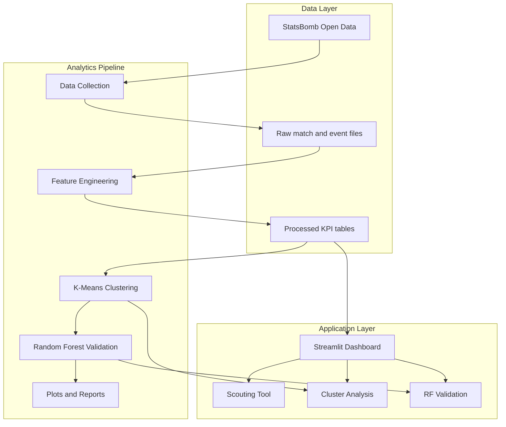

# Football Player Analytics Platform


Football Player Analytics Platform is a thesis driven football analytics project built with Python and Streamlit. It uses StatsBomb Open Data from the FIFA World Cup 2022 to calculate position specific KPIs, identify player archetypes with K-Means clustering, validate cluster separation with Random Forest models, and present the results through an interactive scouting dashboard.

---

## Demo Video

[Watch the demo](assets/demo/demo.mp4)

## Project Scope

- Position specific KPI engineering for six tactical roles: midfielder, center back, full back, winger, forward, and goalkeeper
- Machine learning based player archetype discovery with K-Means clustering and multi metric optimal k selection
- Statistical validation with Random Forest classification, feature importance rankings, and correlation checks against F-statistics
- Interactive Streamlit dashboard for player scouting, cluster analysis, and model validation
- Thesis ready outputs including cluster summaries, feature importance tables, PCA projections, heatmaps, and radar charts
- Local pipeline scripts for data collection, KPI generation, clustering, visualization, and reporting

## Architecture



## Stack

| Layer | Technology |
| --- | --- |
| Language | Python 3.9+ |
| Data Processing | pandas, NumPy, SciPy, PyArrow |
| Data Source | StatsBombPy / StatsBomb Open Data |
| Machine Learning | scikit learn, joblib |
| Visualization | Plotly, Matplotlib, Seaborn, mplsoccer, Kaleido |
| Dashboard | Streamlit |
| Reporting | ReportLab, python-docx |
| Utilities | tqdm |

## Main Modules

### Data Collection

- `src/data_collection/collect_wc2022_events.py`
- `src/data_collection/validate_player_sample.py`

Collects FIFA World Cup 2022 matches and event data, filters the selected positions, and generates player minute summaries.

### Feature Engineering

- `src/feature_engineering/calculate_kpis.py`
- `src/feature_engineering/clean_kpi_data.py`
- `src/utils/kpi_helpers.py`
- `src/utils/position_mapping.py`

Transforms raw event data into position specific KPI datasets used by the clustering and validation steps.

### Clustering

- `src/clustering/optimal_k_selection.py`
- `src/clustering/kmeans_clustering.py`
- `src/clustering/cluster_profiling.py`
- `src/clustering/cluster_visualization.py`
- `scripts/clustering/cluster_all_positions.py`
- `scripts/clustering/batch_cluster_remaining_positions.py`

Runs the clustering workflow, selects the optimal number of clusters, generates tactical archetypes, and exports visual outputs.

### Validation

- `src/feature_importance/rf_feature_importance.py`
- `scripts/validation/run_rf_all_positions.py`

Evaluates cluster separability with Random Forest models and produces feature importance rankings for each position.

### Dashboard

- `src/app/Dashboard.py`
- `src/app/pages/Scouting_Tool.py`
- `src/app/pages/K_Means_Clustering_Analysis.py`
- `src/app/pages/Random_Forest_Validation.py`

Provides an interactive interface for thesis presentation, player comparison, archetype exploration, and validation review.

## Dashboard Pages

| Page | File | Purpose |
| --- | --- | --- |
| Home Dashboard | `src/app/Dashboard.py` | Project overview, key metrics, position summaries |
| Scouting Tool | `src/app/pages/Scouting_Tool.py` | Player comparison, pizza charts, percentile based scouting |
| K-Means Clustering Analysis | `src/app/pages/K_Means_Clustering_Analysis.py` | PCA views, cluster distributions, tactical profile exploration |
| Random Forest Validation | `src/app/pages/Random_Forest_Validation.py` | Validation metrics, RF importance, F-statistics comparison |

## Repository Layout

```text
Football/
|-- data/
|   |-- raw/
|   `-- processed/
|-- docs/
|   |-- CLUSTERING_ANALYSIS_REPORT.md
|   |-- RF_FEATURE_IMPORTANCE_REPORT.md
|   `-- STATISTICAL_SUMMARY.md
|-- outputs/
|   `-- clustering/plots/
|-- scripts/
|   |-- analysis/
|   |-- clustering/
|   |-- validation/
|   `-- visualization/
|-- src/
|   |-- app/
|   |-- clustering/
|   |-- data_collection/
|   |-- feature_engineering/
|   |-- feature_importance/
|   `-- utils/
|-- requirements.txt
|-- LICENSE
`-- README.md
```

## Methodology Snapshot

| Position | Players | Archetypes | Validation Accuracy |
| --- | ---: | ---: | ---: |
| Midfielder | 83 | 2 | 87.6% |
| Center Back | 74 | 2 | 86.2% |
| Forward | 45 | 2 | 97.8% |
| Winger | 55 | 2 | 96.4% |
| Full Back | 69 | 4 | 98.6% |
| Goalkeeper | 32 | 4 | 78.6% |
| Total | 358 | 16 | 93.3% mean |

## Local Development

### Prerequisites

- Python 3.9 or higher
- `pip`
- Optional: virtual environment tooling (`venv`)

### Install Dependencies

```bash
python -m venv venv
```

Windows:

```bash
venv\Scripts\activate
```

macOS / Linux:

```bash
source venv/bin/activate
```

Install requirements:

```bash
pip install -r requirements.txt
```

### Run the Dashboard

If processed data already exists locally, start the application directly:

```bash
streamlit run src/app/Dashboard.py
```

## Full Pipeline

Use the following steps if you want to regenerate the project outputs from source data.

### 1. Collect FIFA World Cup 2022 Data

```bash
python src/data_collection/collect_wc2022_events.py
```

### 2. Calculate KPIs

```bash
python src/feature_engineering/calculate_kpis.py
```

### 3. Run Clustering for a Position

```bash
python scripts/clustering/cluster_all_positions.py --position "Midfielder"
```

Example valid values:

- `Midfielder`
- `Center Back`
- `Full Back`
- `Winger`
- `Forward`
- `Goalkeeper`

### 4. Run Random Forest Validation

```bash
python scripts/validation/run_rf_all_positions.py
```

### 5. Generate Statistical Summary

```bash
python scripts/analysis/generate_statistical_summary.py
```

## Data and Outputs

- `data/raw/` stores raw World Cup event and match files
- `data/processed/` stores KPI tables, cleaned datasets, clustering outputs, and validation results
- `outputs/` stores generated figures such as PCA plots, radar charts, heatmaps, and optimal k visuals

The project is configured to keep large raw data, processed artifacts, cache files, and generated outputs out of version control through `.gitignore`. The current local workspace may already contain sample outputs for development and demonstration purposes.

## Reports and Documentation

- `docs/CLUSTERING_ANALYSIS_REPORT.md`
- `docs/RF_FEATURE_IMPORTANCE_REPORT.md`
- `docs/STATISTICAL_SUMMARY.md`
- `docs/README.md`


## Notes

- The project is centered on FIFA World Cup 2022 data from StatsBomb Open Data.
- KPI definitions differ by position to reflect tactical role differences rather than one size fits all player evaluation.
- The Streamlit app includes a presentation oriented experience for thesis demos and stakeholder walkthroughs.
- Some generated files in `data/` and `outputs/` can become large, so it is best to keep the repository focused on source code and documentation unless you intentionally want to publish sample artifacts.
- There is currently no dedicated automated test suite in the repository; validation is primarily analytical and output driven.

## License

- Code: [MIT](LICENSE)
- Data: StatsBomb Open Data is subject to its own usage and attribution terms

If you publish this project, make sure any redistributed data or figures remain compliant with StatsBomb's license conditions.

## Contributing

Contributions are welcome.

If you find a bug, have an improvement idea, or want to suggest a research extension, feel free to open an issue or submit a pull request.

Suggested flow:

1. Fork the repository
2. Create a feature branch
3. Commit your changes
4. Push the branch
5. Open a pull request

## Links

[](mailto:ismailsariarslan7@gmail.com)
[](https://www.instagram.com/ismailsariarslan/)
[](https://www.linkedin.com/in/ismailsariarslan/)
